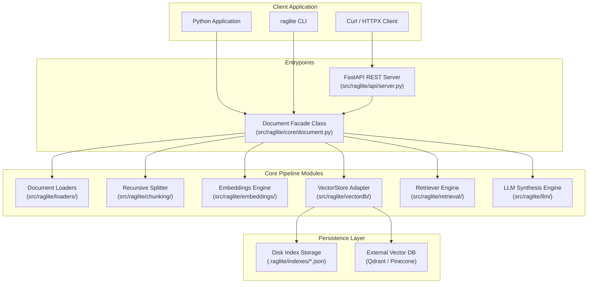

# RAGLite Python (`raglite-toolkit`) Architecture

This document details the software architecture, component design, data flow, and APIs of the Python implementation of **RAGLite** (`raglite-toolkit`).

---

## 1. Overview & Core Philosophy

`raglite-toolkit` is a Python-native Retrieval-Augmented Generation library built with Pydantic v2 and FastAPI. It provides zero-boilerplate semantic search, multi-provider LLM response synthesis, and self-hosted REST APIs over local files.

### Key Characteristics
* **Python-Native & Type-Annotated**: Modern Python 3.11+ typing with Pydantic v2 model validation and camelCase alias serialization.
* **1:1 Parity with TypeScript SDK**: Identical function signatures, option dictionaries, data models, and `.raglite/` persistence layout.
* **Pluggable & Extensible**: Modular Abstract Base Classes (ABCs) for Loaders, Chunkers, Embeddings, Vector Databases, and LLMs.
* **Per-Document Isolation**: Namespaced vector collections tied to source document path/identity.
* **SHA-256 Content Caching**: Automatically skips re-embedding if document content has not changed.
* **Small Core, Optional Providers**: Provider SDKs (`openai`, `anthropic`, `google-genai`, `cohere`, `mistralai`, `voyageai`) and `sentence-transformers` are optional extras (`pip install 'raglite-toolkit[openai,local]'`). They are imported on first use; a missing one becomes a `ConfigError` naming the `pip install` command (`import_optional()` in `errors.py`).
* **Offline-First Option**: Local offline embeddings via `sentence-transformers` (`all-MiniLM-L6-v2`, the `[local]` extra) and local LLMs via Ollama.

---

## 2. Directory & Module Structure

```
raglite-py/src/raglite/
├── api/             # FastAPI REST HTTP server & Pydantic schemas
│   ├── __init__.py
│   ├── schemas.py
│   └── server.py
├── chunking/        # Text splitting algorithms
│   ├── __init__.py
│   ├── base.py
│   ├── locations.py  # page and markdown section of each chunk
│   └── recursive.py
├── core/            # Main facade orchestrator
│   ├── __init__.py
│   ├── collection.py
│   └── document.py
├── embeddings/      # Embedding provider factory & adapters
│   ├── __init__.py
│   ├── base.py
│   ├── factory.py
│   ├── local.py      # sentence-transformers (offline, [local] extra)
│   ├── models.py
│   └── remote.py     # OpenAI, Gemini, Mistral, Cohere, Voyage, Ollama
├── llm/             # LLM provider factory & prompt synthesis
│   ├── __init__.py
│   ├── answer.py
│   ├── factory.py
│   ├── models.py
│   └── prompt.py
├── loaders/         # Document parser implementations
│   ├── __init__.py
│   ├── base.py
│   ├── docx.py       # python-docx reader
│   ├── json.py
│   ├── markdown.py
│   ├── pdf.py        # pypdf reader; keeps page texts for page numbers
│   └── txt.py
├── retrieval/       # Retriever & ranking algorithms
│   ├── __init__.py
│   └── retriever.py
├── vectordb/        # Vector Database adapters
│   ├── __init__.py
│   ├── base.py       # VectorStore Abstract Base Class
│   ├── factory.py
│   ├── memory.py     # Local JSON persistence (.raglite/)
│   ├── pinecone.py   # Pinecone Cloud
│   └── qdrant.py     # Qdrant local/cloud
├── mcp_server.py    # MCP server: search, ask, list_sources ([mcp] extra)
├── tools.py         # as_tool(): function-calling tool, shared passage shape
├── cli.py           # Command-line interface tool (argparse)
├── config.py        # Environment & default configuration
├── constants.py     # System constants & defaults
├── errors.py        # Custom RAGLite exception definitions + import_optional()
├── types.py         # Pydantic v2 data models & type aliases
└── utils/           # Utility functions (hashing, math, crypto)
```

---

## 3. High-Level System Diagram



---

## 4. End-to-End Data Pipeline

### 4.1 Ingestion & Indexing
1. `doc.build()` invokes the appropriate `BaseLoader` based on file extension (`.pdf`, `.txt`, `.json`, `.md`, `.docx`). A document made with `Document.from_text(id, text)` skips the loader and uses the given text; its namespace is derived from `text:<id>` (same as the TypeScript SDK), and `id` is the chunks' `source`.
2. Calculates SHA-256 hash of raw document content.
3. Checks existing `IndexMetadata` in `VectorStore`. The cached index is reused when the index format version, content hash, chunk size, overlap and embedding provider/model all match (URL sources are hashed by their fetched text).
4. If hash differs or force rebuild requested:
   - `RecursiveChunker` splits text into word-based chunks (default 500 words, 50-word overlap). In scripts written without spaces (Chinese, Japanese, Thai, ...) each character counts as one word.
   - `EmbeddingFactory` generates normalized vectors for each chunk.
   - `VectorStore.add()` saves chunks and `VectorStore.save_index_metadata()` persists index metadata.
   - `KeywordIndex.build()` builds the BM25 keyword index from the chunk texts and saves it as `<storeDir>/<namespace>/keyword.json`.

### 4.2 Retrieval & Answer Synthesis
1. `doc.search(query, top_k=..., mode=...)`:
   - `vector` (default): embeds the query and runs `VectorStore.search()` (cosine similarity over L2-normalized vectors).
   - `keyword`: BM25 over the keyword index (`retrieval/keyword_index.py`), or the store's own `keyword_search()` if it has one.
   - `hybrid`: both lists (each `candidates` long, the vector list filtered by `scoreThreshold`), merged with Reciprocal Rank Fusion (`retrieval/fusion.py`).
   - Terms come from the `raglite-v1` tokenizer (`text/tokenizer.py`): NFKC + lowercase words, code identifiers kept whole, character bigrams for CJK and Thai. The TypeScript SDK must produce identical terms and scores; `tests/fixtures/shared/` checks this.
   - `DocumentCollection` merges every document's vector list and keyword list first and fuses once, because BM25 statistics are per document.
2. `doc.ask(question, options)`:
   - Runs `search(question)` with the same retrieval options.
   - Constructs context-augmented system/user prompt via `build_prompt()`.
   - Calls `generate_answer()` or `stream_answer()` with selected LLM adapter (OpenAI, Anthropic, Google, Groq, Ollama, etc.).

### 4.3 Citations and chunk locations
- `RecursiveChunker.spans()` returns each chunk with the range of units it covers. `chunking/locations.py` maps that range to a page (PDF page texts from the loader) or to the markdown heading path in effect, and `build()` stores `page`, `pageEnd` and `section` in the chunk metadata, only when known, so the stored JSON matches the TypeScript SDK's. Chunk boundaries do not depend on it, so existing indexes stay valid.
- The prompt labels each passage `[n] (source #chunk, p. 12, Section)`. `extract_citations()` reads the `[n]` markers in the answer and returns those passages as `citations`.
- `tests/fixtures/shared/locations.json` (generated by the TypeScript SDK) pins page, section and citation parsing for both SDKs.

### 4.4 Agents
- `raglite mcp` builds the index, then serves it with `serve_mcp()` over stdio. Logs go to stderr, because stdout carries the protocol.
- `as_tool()` wraps `search()` as a `SearchTool` with OpenAI and Anthropic tool definitions; the MCP `search` tool returns the same passage shape (`to_passage()`).

---

## 5. REST API Architecture

Built using **FastAPI** framework for async capabilities, automatic OpenAPI docs, and Uvicorn serving.

| Method | Endpoint | Auth Required? | Description |
| :--- | :--- | :--- | :--- |
| `GET` | `/health` | No | Liveness status & total chunk count |
| `GET` | `/info` | Yes (Bearer token) | Configuration details & index state |
| `POST` | `/search` | Yes (Bearer token) | Vector, keyword or hybrid search (`mode`) |
| `POST` | `/ask` | Yes (Bearer token) | Context Q&A generation (supports streaming via StreamingResponse) |

---

## 6. Vector Database Abstract Base Class (`src/raglite/vectordb/base.py`)

```python
from abc import ABC, abstractmethod
from typing import List, Optional
from raglite.types import IndexMetadata, StoredChunk
from raglite.vectordb.base import VectorSearchHit

class VectorStore(ABC):
    @property
    @abstractmethod
    def namespace(self) -> str: ...

    @abstractmethod
    def load(self) -> None: ...

    @abstractmethod
    def reset(self) -> None: ...

    @abstractmethod
    def add(self, chunks: List[StoredChunk]) -> None: ...

    @abstractmethod
    def search(self, embedding: List[float], top_k: int) -> List[VectorSearchHit]: ...

    @abstractmethod
    def count(self) -> int: ...

    @abstractmethod
    def save_index_metadata(self, metadata: IndexMetadata) -> None: ...

    @abstractmethod
    def read_index_metadata(self) -> Optional[IndexMetadata]: ...

    # Optional (return None when unsupported):
    def list_chunks(self) -> Optional[List[IndexedChunk]]: ...  # rebuild a missing keyword index
    def keyword_search(self, query: str, top_k: int) -> Optional[List[VectorSearchHit]]: ...  # native keyword search
```
